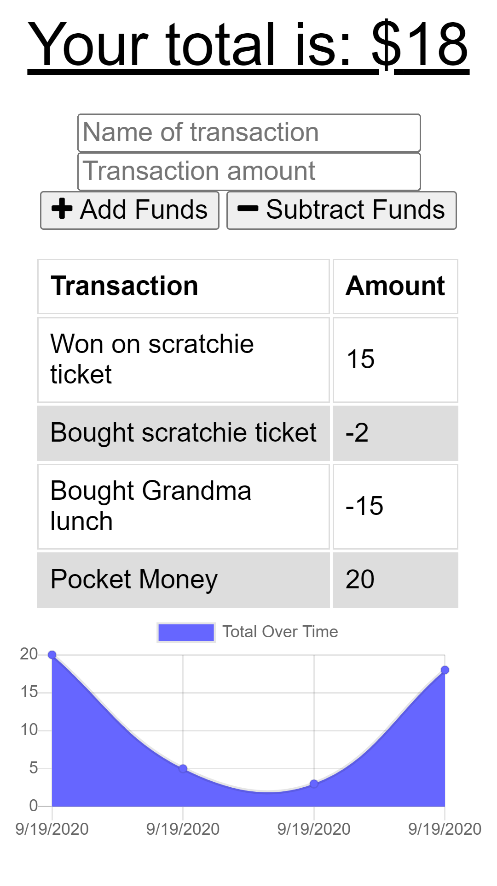
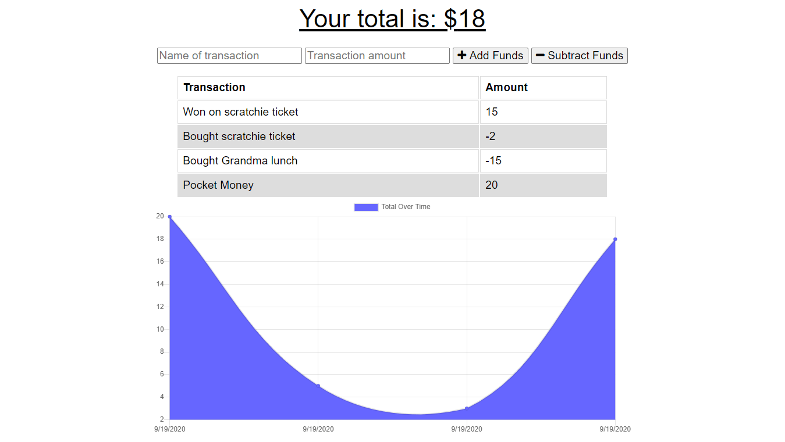

# Budget Tracker
## Description
Week 18 homework for my bootcamp.
This is a Progressive Web App (PWA) for tracking money, designed for offline use.  

## Table of Contents
1. [Installation](#Installation)
2. [Usage](#Usage)
3. [License](#License)
4. [Questions](#Questions)
## Installation
This is a progressive web app and can be installed to any compatible device after visiting the live [link](https://andrew-budget.herokuapp.com)
## Usage
Enter your expenditure and income into the appropriate fields and a graph will be generated using that information.  When a connection to the server can be made, the data will be saved to the database. If no connection is available the data will be stored on your device until a connection can be made.  

## License
This project uses a MIT license.
## Questions
You can find my github account at
[Andrew836-dev](https://github.com/Andrew836-dev)  
Or you can email me andrew.aj.gray@gmail.com
